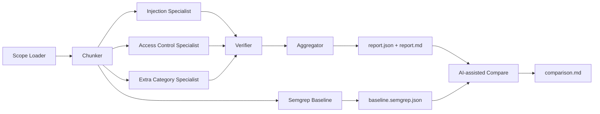
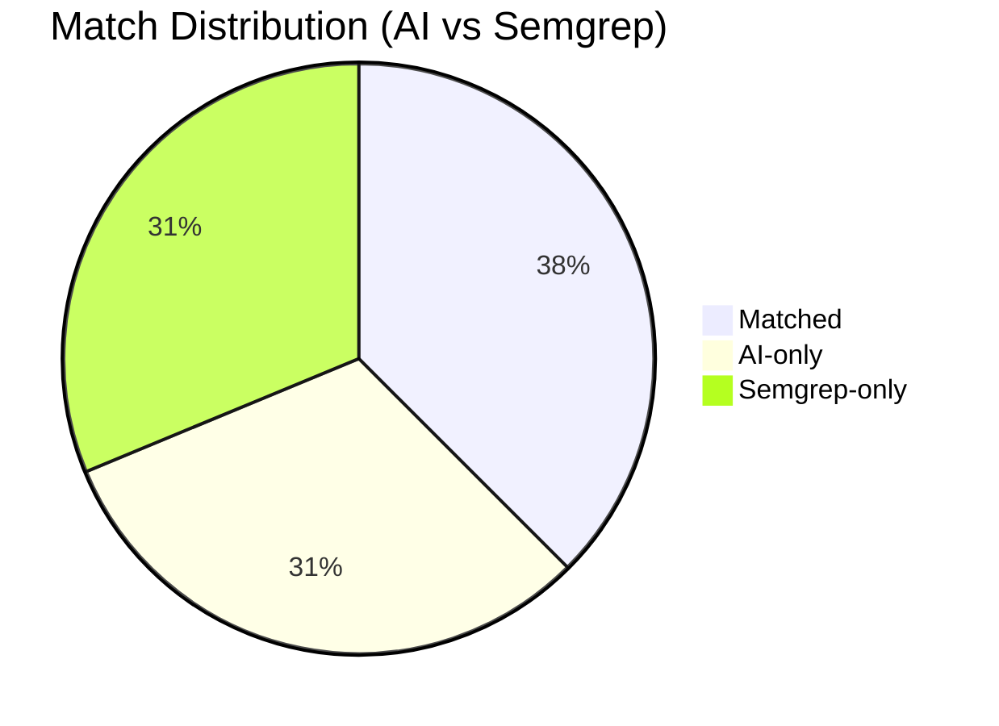

# Secure Code Inspector

AI Workflow: Secure Code Analysis, Semgrep Baseline, and OWASP Comparison.

Primary interface: Streamlit web app (`web_app.py`)  
Fallback interface: CLI (`python -m secure_inspector ...`)

## What This Project Does

- Scans a fixed source-code scope from an uploaded ZIP.
- Uses a configurable multi-agent AI pipeline to detect security issues.
- Maps findings to OWASP Top 10 categories.
- Generates actionable fixes with confidence scores and evidence.
- Runs Semgrep baseline and compares AI vs baseline with metrics.

Generated artifacts:

- `outputs/report.json`
- `outputs/report.md`
- `outputs/baseline.semgrep.json`
- `outputs/comparison.md`

## Agent Orchestration

Always-on agents:

1. `InjectionSpecialistAgent`
2. `AccessControlSpecialistAgent`
3. `VerifierAgent`
4. `AggregatorAgent`

Conditional agent:

1. `ExtraCategorySpecialistAgent` (runs when profile includes non-core categories)



## Current Evaluation Snapshot

Based on latest files in `outputs/`:

| Metric | Value |
|---|---:|
| AI Verified Findings | 11 |
| Semgrep Verified Findings | 11 |
| Matched | 6 |
| AI-only | 5 |
| Semgrep-only | 5 |
| Precision | 55% |
| Recall | 55% |



## UI Screenshots

Run AI tab:


Run Baseline tab:


Compare tab:


Artifacts tab:


Settings and Help tab:


## Project Structure

| Path | Purpose |
|---|---|
| `web_app.py` | Streamlit web UI |
| `src/secure_inspector/` | Core pipeline, agents, reporting, baseline, evaluation |
| `configs/` | Scope/profile/pipeline configuration |
| `prompts/` | Agent prompt templates + few-shot examples |
| `data/` | OWASP mapping and secure coding guidance |
| `outputs/` | Generated artifacts |
| `tests/` | Unit/integration tests for key pipeline behaviors |
| `prompt_log.md` | Prompt versions and improvement rationale |

## Prerequisites

- Python 3.12+
- Semgrep available in PATH
- OpenAI API key

## Local Setup

```powershell
python -m venv env
.\env\Scripts\activate
pip install -e .
```

## Run Web App

```powershell
streamlit run web_app.py
```

Workflow:

1. Open `Run AI`.
2. Enter your OpenAI API key (session only).
3. Upload ZIP of your target repository (or fixed Juice Shop scope).
4. Run AI pipeline.
5. Open `Run Baseline` and run Semgrep baseline.
6. Open `Compare` to compute metrics.
7. Open `Artifacts` to download final files.

## CLI Fallback

Run AI:

```powershell
python -m secure_inspector run --target-path <PATH_TO_REPO> --scope-config configs/scope.juiceshop.yaml --profile-config configs/profile.yaml --pipeline-config configs/pipeline.yaml --out-dir outputs
```

Run baseline:

```powershell
python -m secure_inspector baseline --target-path <PATH_TO_REPO> --scope-config configs/scope.juiceshop.yaml --out-dir outputs
```

Run comparison:

```powershell
python -m secure_inspector compare --ai-report outputs/report.json --baseline outputs/baseline.semgrep.json --out outputs/comparison.md
```

## Deployment (Streamlit Community Cloud)

1. Push repository to public GitHub.
2. Create app on Streamlit Cloud.
3. Set entry file: `web_app.py`.
4. Deploy and share URL.

If hosted Semgrep execution is limited, run baseline locally and keep the generated artifact in `outputs/`.

## Security Notes

- API key is entered by end users at runtime.
- The app does not persist user keys.
- Keep real secrets out of `.env` and source control.

## Roadmap

- Improve recall for server-side access-control patterns.
- Add optional second baseline integration (e.g., CodeQL/SonarQube).
- Add CI pipeline for automated test + lint + artifact checks.
