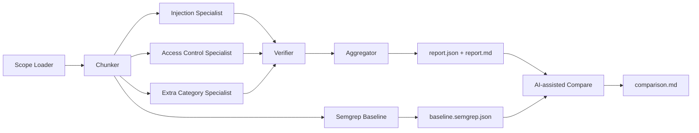
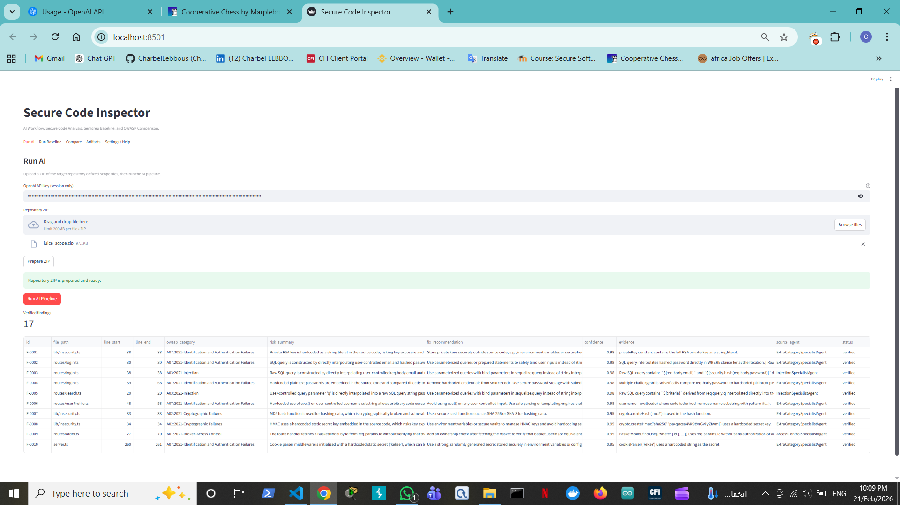
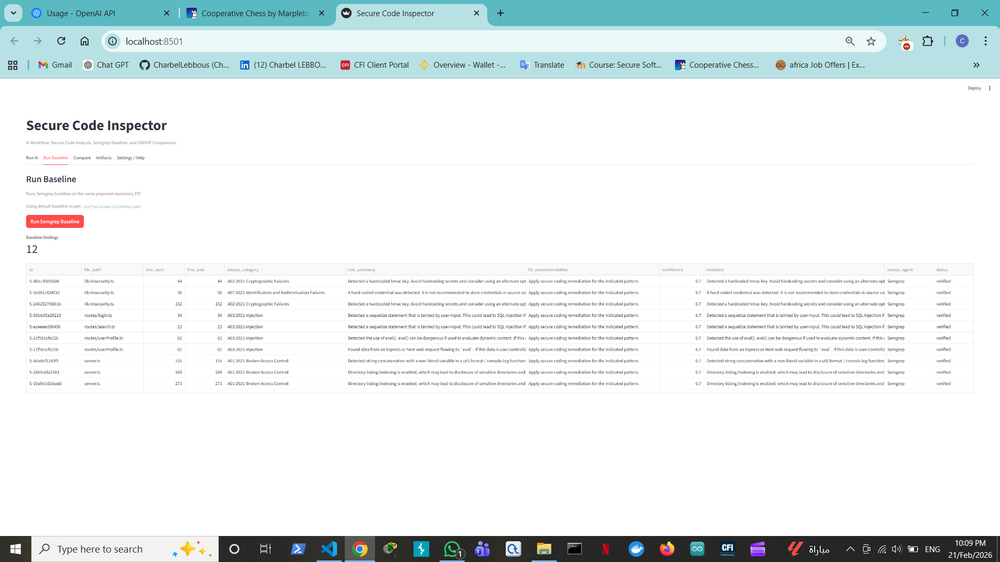
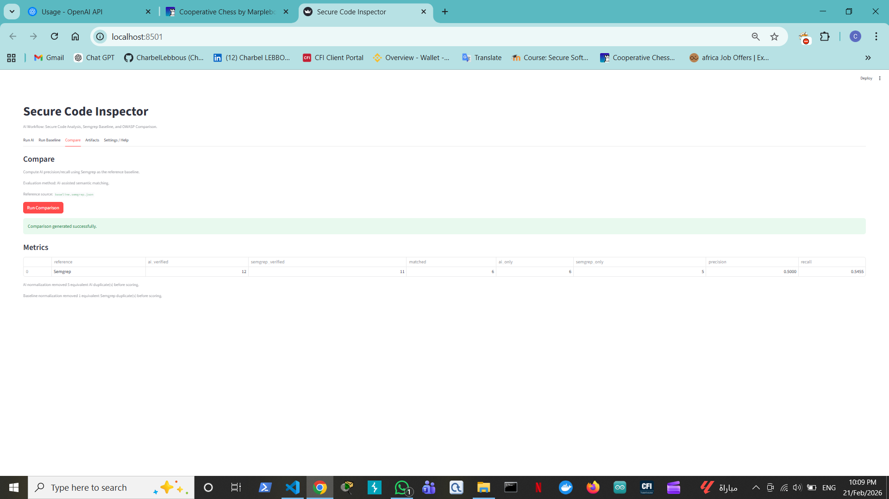
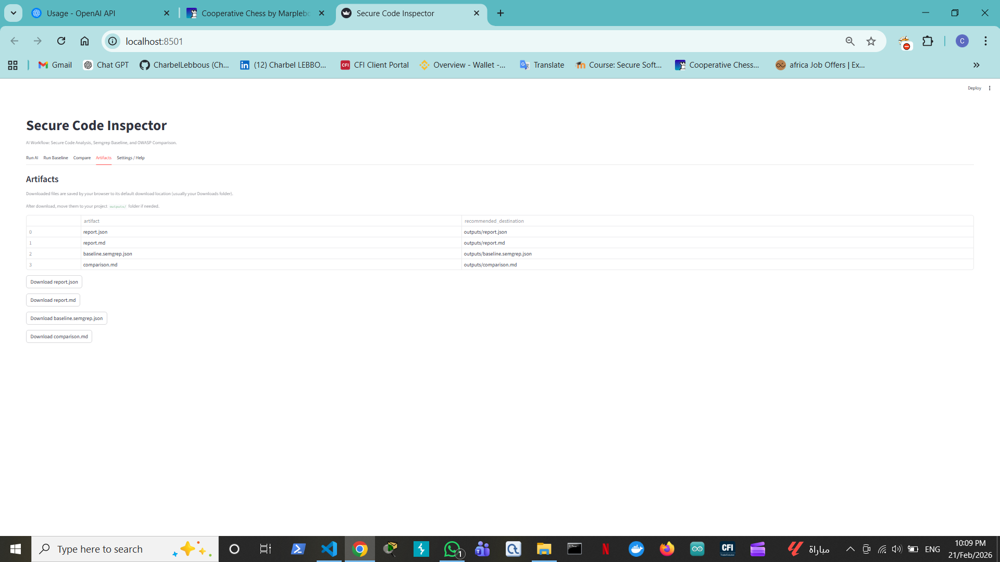
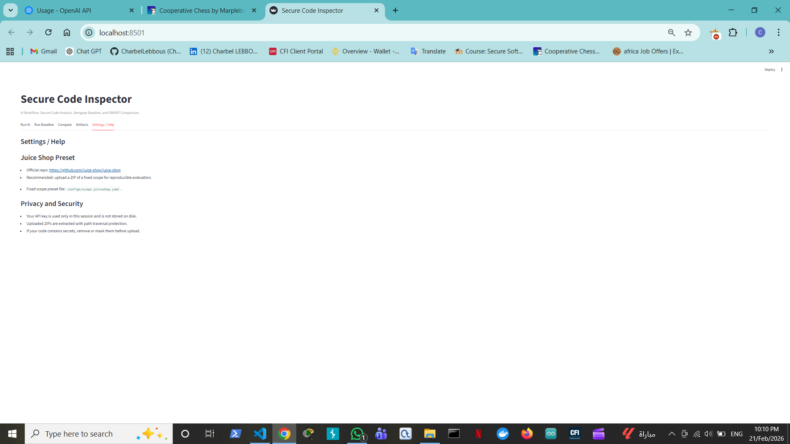

# Secure Code Inspector

AI workflow for secure code analysis with OWASP mapping, Semgrep baseline, and AI-assisted comparison.

Primary interface: Streamlit web app (`web_app.py`)  
Fallback interface: CLI (`python -m secure_inspector ...`)

## Live App

https://secure-code-aiinspector.streamlit.app/

## Features

- ZIP-based repository scanning (fixed-scope, reproducible workflow).
- Multi-agent AI pipeline with configurable OWASP categories.
- Structured findings with file/line, risk summary, fix recommendation, confidence, and evidence.
- Semgrep baseline on the same scope.
- AI-assisted comparison report with precision/recall, false positives, and misses.

Generated artifacts:

- `outputs/report.json`
- `outputs/report.md`
- `outputs/baseline.semgrep.json`
- `outputs/comparison.md`

## Architecture

Always-on agents:

1. `InjectionSpecialistAgent`
2. `AccessControlSpecialistAgent`
3. `VerifierAgent`
4. `AggregatorAgent`

Conditional agent:

1. `ExtraCategorySpecialistAgent` (enabled when non-core categories are present)



## UI Screenshots

Run AI tab:



Run Baseline tab:



Compare tab:



Artifacts tab:



Settings and Help tab:



## Project Structure

| Path | Purpose |
|---|---|
| `web_app.py` | Streamlit web UI entrypoint |
| `src/secure_inspector/` | Core pipeline, agents, reporting, baseline, evaluation |
| `configs/` | Scope/profile/pipeline configuration |
| `prompts/` | Agent prompt templates + few-shot examples |
| `data/` | OWASP mapping and secure coding guidance |
| `outputs/` | Generated artifacts |
| `tests/` | Unit tests for core components |
| `prompt_log.md` | Prompt versions and rationale |

## Prerequisites

- Python 3.12+
- Semgrep available in PATH
- OpenAI API key

## Quick Start

```powershell
python -m venv env
.\env\Scripts\activate
pip install -e .
streamlit run web_app.py
```

## Web Workflow

1. Open `Run AI`.
2. Enter your OpenAI API key (session only).
3. Upload a repository ZIP.
4. Run AI pipeline.
5. Open `Run Baseline` and run Semgrep.
6. Open `Compare` to generate metrics and analysis.
7. Open `Artifacts` to download results.

## CLI Workflow

Run AI:

```powershell
python -m secure_inspector run --target-path <PATH_TO_REPO> --scope-config configs/scope.juiceshop.yaml --profile-config configs/profile.yaml --pipeline-config configs/pipeline.yaml --out-dir outputs
```

Run baseline:

```powershell
python -m secure_inspector baseline --target-path <PATH_TO_REPO> --scope-config configs/scope.juiceshop.yaml --out-dir outputs
```

Run comparison:

```powershell
python -m secure_inspector compare --ai-report outputs/report.json --baseline outputs/baseline.semgrep.json --out outputs/comparison.md
```

## Deployment (Streamlit Cloud)

1. Connect the GitHub repository.
2. Set main file to `web_app.py`.
3. Deploy.

If hosted Semgrep execution is restricted, run baseline locally and keep baseline artifact in `outputs/`.

## Security

- API key is entered by users at runtime.
- The app does not persist API keys.
- Do not commit real secrets (`.env`, tokens, private keys).

## License

MIT (see `LICENSE`).
